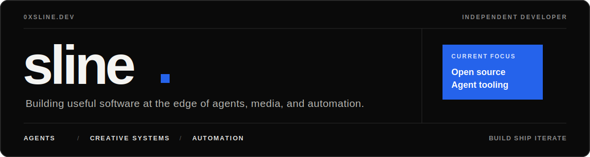

  

  
  
  

## What I build

<table>
  <tr>
    <td width="33%" valign="top">
      <h3>🤖 Agent Systems</h3>
      
Tool-using agents, MCP integrations, skills, memory, and reliable human-in-the-loop workflows.

    </td>
    <td width="33%" valign="top">
      <h3>🎬 Creative AI</h3>
      
Local-first video tooling, generative media pipelines, and editable AI-assisted production.

    </td>
    <td width="33%" valign="top">
      <h3>⚙️ Automation</h3>
      
Browser automation, developer experience, and practical open-source tools that remove repetitive work.

    </td>
  </tr>
</table>

## Stack

  
  
  
  
  
  
  
  
  

## GitHub snapshot

  
  

## Contribution trail

<picture>
  <source media="(prefers-color-scheme: dark)" srcset="./profile/contribution-snake-dark.svg" />
  <source media="(prefers-color-scheme: light)" srcset="./profile/contribution-snake.svg" />
  
</picture>

  Building practical intelligence — one useful tool at a time.

